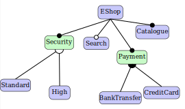

# Feature Model Visualization

Visualize [Feature Models](https://en.wikipedia.org/wiki/Feature_model#Feature_modeling_notations) using the Penrose diagram language. The domain includes common relationships

* Mandatory – child feature must be selected.
* Optional – child feature can be selected or not selected.
* Or – at least one of the sub-features must be selected.
* Alternative (xor) – exactly one of the sub-features must be selected
* Requires - if a feature is selected, the required feature must also be selected
* Excludes - if a feature is selected, the excluded feature cannot be selected
